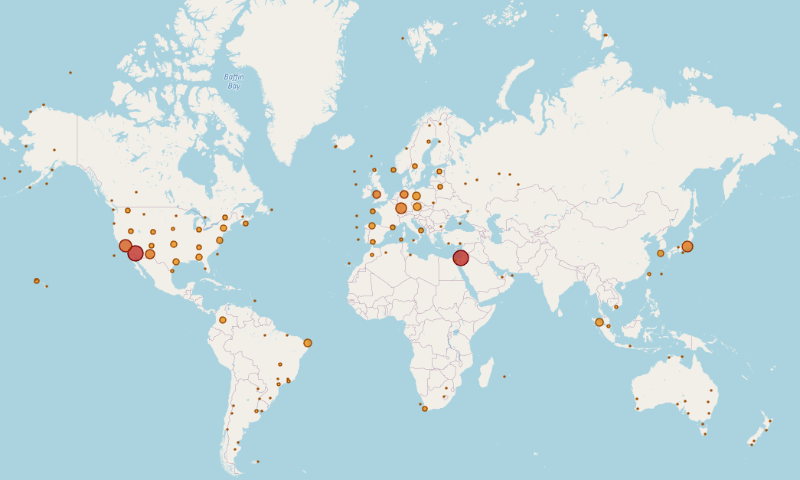

# sondehub-site-finder
Script that uses reverse flight predictions to find likely undefined radiosonde launch sites - 6841

## Fetching reverse predictions

This data is stored in the SondeHub OpenSearch cluster.

```
elasticdump --input https://search-sondes-v2-7-9-wocgfxx4dbaclzlugzanzqpdfq.us-east-1.es.amazonaws.com/reverse-prediction-* --output reverse-prediction-index.json --type=data --size=100 --awsAccessKeyId ACCESS_KEY --awsSecretAccessKey ACCESS_SECRET --awsRegion us-east-1
```

## Preliminary Investigation

These highlight potential unrecordered launch sites

